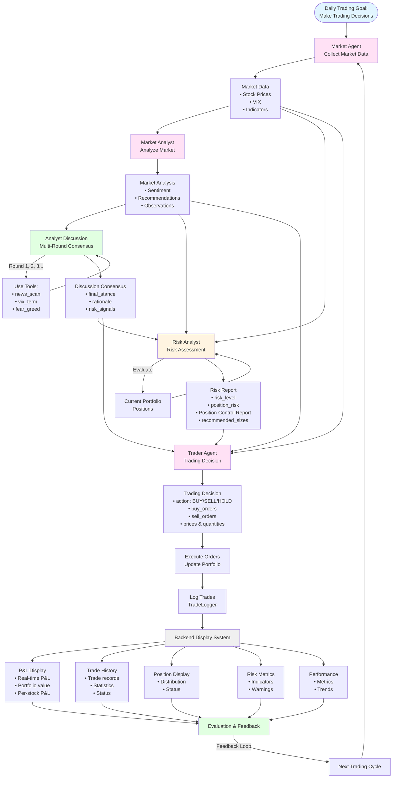

# 🎨 图表生成工具推荐

## 📊 推荐工具清单

### 1. **Mermaid Live Editor** ⭐⭐⭐⭐⭐ (最推荐)

**网址**: https://mermaid.live/

**优点**:
- ✅ 免费在线工具
- ✅ 直接支持 Mermaid 语法
- ✅ 实时预览
- ✅ 可导出为 PNG/SVG
- ✅ 代码友好

**使用方法**:
1. 打开 https://mermaid.live/
2. 复制 `docs/AGENT_SYSTEM_MERMAID.md` 中的 Mermaid 代码
3. 粘贴到编辑器
4. 实时预览并导出

**适用**: `docs/AGENT_SYSTEM_MERMAID.md` 中的所有图表

---

### 2. **Draw.io (diagrams.net)** ⭐⭐⭐⭐⭐

**网址**: https://app.diagrams.net/

**优点**:
- ✅ 完全免费
- ✅ 功能强大
- ✅ 支持多种图表类型
- ✅ 可导出多种格式
- ✅ 可导入/导出为 XML
- ✅ 可集成到 GitHub

**使用方法**:
1. 打开 https://app.diagrams.net/
2. 选择 "Create New Diagram"
3. 选择 "Blank Diagram" 或 "Flowchart"
4. 手动绘制（或使用模板）
5. 导出为 PNG/SVG/PDF

**提示**: 可以根据 `docs/AGENT_SYSTEM_FLOWCHART.md` 的 ASCII 流程图手动绘制

---

### 3. **Excalidraw** ⭐⭐⭐⭐

**网址**: https://excalidraw.com/

**优点**:
- ✅ 免费开源
- ✅ 手绘风格（类似示例图片）
- ✅ 美观易用
- ✅ 实时协作
- ✅ 可导出 PNG/SVG

**使用方法**:
1. 打开 https://excalidraw.com/
2. 使用工具栏绘制流程图
3. 可以导入/导出

**适用**: 想要手绘风格效果时

---

### 4. **Whimsical** ⭐⭐⭐⭐

**网址**: https://whimsical.com/

**优点**:
- ✅ 现代化界面
- ✅ 易于使用
- ✅ 美观的流程图
- ✅ 免费版有限制

**使用方法**:
1. 注册账号（免费）
2. 创建 Flowchart
3. 手动绘制
4. 导出为 PNG/PDF

---

### 5. **Lucidchart** ⭐⭐⭐

**网址**: https://www.lucidchart.com/

**优点**:
- ✅ 专业流程图工具
- ✅ 功能强大
- ⚠️ 免费版有限制

**使用方法**:
1. 注册账号
2. 创建 Flowchart
3. 手动绘制
4. 导出

---

### 6. **PlantUML** ⭐⭐⭐

**网址**: 
- Online: http://www.plantuml.com/plantuml/
- VS Code Extension: PlantUML

**优点**:
- ✅ 代码生成图表
- ✅ 类似 Mermaid
- ✅ 免费开源

**使用方法**:
1. 可以使用 PlantUML 语法
2. 在线渲染或使用 VS Code 扩展

---

## 🎯 针对你的需求推荐

### 推荐方案 1: **Mermaid Live Editor** (最快最简单)

1. 打开 https://mermaid.live/
2. 复制以下代码（主流程图）:

3. 点击右上角 "Actions" → "Download PNG" 或 "Download SVG"

---

### 推荐方案 2: **Excalidraw** (手绘风格，类似示例)

1. 打开 https://excalidraw.com/
2. 参考 `docs/AGENT_SYSTEM_FLOWCHART.md` 的 ASCII 流程图
3. 手动绘制，使用手绘风格元素
4. 导出为 PNG

**提示**: Excalidraw 的手绘风格更接近示例图片的视觉效果

---

### 推荐方案 3: **Draw.io** (最灵活，功能强大)

1. 打开 https://app.diagrams.net/
2. 选择 "Flowchart" 模板
3. 参考 ASCII 流程图手动绘制
4. 可以使用图标和颜色美化
5. 导出为 PNG/SVG/PDF

---

## 🔧 快速开始 - Mermaid Live Editor

### 步骤 1: 打开工具
访问: https://mermaid.live/

### 步骤 2: 复制代码
从 `docs/AGENT_SYSTEM_MERMAID.md` 复制 Mermaid 代码

### 步骤 3: 粘贴并预览
粘贴到左侧编辑器，右侧实时预览

### 步骤 4: 导出
点击右上角 "Actions" → "Download PNG" 或 "Download SVG"

---

## 📝 其他推荐

### VS Code Extension
- **Mermaid Preview**: 在 VS Code 中预览 Mermaid 图表
- **PlantUML**: PlantUML 支持

### 在线工具
- **Mermaid.ink**: Mermaid 图表转图片 API
- **Kroki**: 支持多种图表语法（包括 Mermaid）

---

## 🎨 生成类似示例图片的建议

如果想要生成类似示例图片的**手绘风格**流程图：

1. **使用 Excalidraw** - 最接近手绘风格
2. **使用 Draw.io** - 可以选择手绘风格主题
3. **使用 Whimsical** - 现代化但简洁的风格

如果想要**专业流程图**：
1. **使用 Mermaid Live Editor** - 代码驱动，易于维护
2. **使用 Draw.io** - 功能最强大
3. **使用 Lucidchart** - 最专业但有限制

---

**推荐**: 对于你的需求，我推荐 **Mermaid Live Editor** 或 **Excalidraw**。

- **Mermaid Live Editor**: 如果你想快速生成，代码已经准备好了
- **Excalidraw**: 如果你想要类似示例图片的手绘风格

